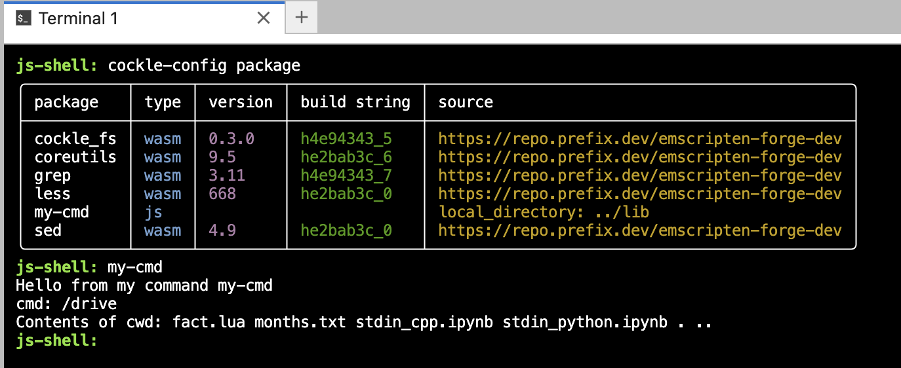

# terminal-javascript-command

An example of a [cockle](https://github.com/jupyterlite/cockle) JavaScript command, showing how to
build and deploy it into a [terminal](https://github.com/jupyterlite/terminal) in a JupyterLite
deployment. The same command can also be used in a `cockle` deployment outside of JupyterLite.

This JavaScript command runs in the `cockle` Web Worker and has direct access to the [Emscripten
file system](https://emscripten.org/docs/api_reference/Filesystem-API.html). For an example of a
TypeScript/JavaScript command that runs in the main UI thread without direct access to the
Emscripten file system see
[terminal-external-command](https://github.com/ianthomas/terminal-external-command) instead.

## Build

To build and deploy you will need
[micromamba](https://mamba.readthedocs.io/en/latest/user_guide/micromamba.html) and
[node.js](https://nodejs.org/). These can both be installed using `mamba`, `micromamba`, `conda`,
etc.

To build use:

```bash
npm install
npm run build
```

The source code for the command is in `src/my-cmd.ts` and the output JavaScript file built using
`rollup` is `lib/my-cmd.js`.

## Use

To use the built `my-cmd.js` in a `cockle` or `terminal` deployment, create or modify the
`cockle-config-in.json` file in the root directory of the deployment to contain JSON similar to:

```json
{
  "packages": {
    "my-cmd": {
      "local_directory": "<relative or absolute path to directory containing my-cmd.js>",
      "wasm": false
    }
  }
}
```

Here the `"local_directory"` is a relative or absolute path to the directory containing the built
`my-cmd.js`, and `"wasm": false` indicates that the command is a pure JavaScript command rather than
the default WebAssembly command.

## Example deployment

The `deploy` directory contains files to create an example JupyterLite deployment.

```bash
cd deploy
```

Create a `micromamba`/`mamba`/`conda` environment containing the required dependencies:

```bash
micromamba create -f deploy-environment.yml
micromamba activate deploy-env
```

Build the deployment into the output `dist` directory:

```bash
jupyter lite build --output-dir dist
```

To serve, use:

```bash
npx static-handler dist
```

and navigate in a web browser to http://localhost:8080/.

To confirm that the command is available and runs correctly, open a terminal and run
`cockle-config package`; you can use tab completion for both parts. This will show that there is a
package called `my-cmd` and it is a `js` package installed from a local directory. You can also list
all available commands by pressing the tab key at an empty prompt.

Run the `my-cmd` command, again using tab completion if you wish. The example command code does some
file system access to show what is possible.


